# Jumper oefening

__Gemaakt door:__

- Cédric Collette (s107601)
- Ruben Messiaen (s107090)

## Inhoudstafel

1. [Requirements](#requirements)
1. [Definities](#definities)
1. [Inleiding](#inleiding)
1. [Rewards en verloop](#rewards-en-verloop)
1. [Installaties en voorbereiding](#installaties-en-voorbereiding)
1. [GameObjecten en scripts](#GameObjecten-en-scripts)
1. [Trainen van de Agent](#bronnen)
1. [Bronnen](#bronnen)

## Requirements

- Python versie 3.8
- Ml-Agents in Python environment
- Unity(Version: 2019.4.10f1)

## Definities

- **Player** - De gebruiker of **agent** die het GameObject 'Player' controleert.
- **Obstacle** - Het obstakel waar de **player** over springt.
- **Agent** - Het GameObject met het neural-network.
- **Coin** - Een GameObject die de **player** kan vangen voor extra punten.

## Inleiding

In deze oefening zullen we een Unity project opbouwen om een **Agent** te trainen. Deze **Agent** zal getraind worden om over obstakels te springen en **Coins** uit de lucht te pakken.

## Rewards en verloop

Een **Player** start bij het begin van elke episode op dezelfde plek. Deze **Player** kan enkel omhoog springen. Er spawnt op willekeurige momenten een **Obstacle** die met dezelfde snelheid naar de **Player** beweegt. Deze snelheid is elke keer anders. De **Player** moet over dit **Obstacle** springen om een beloning te ontvangen.
Er kunnen ook nog Coins spawnen die in de lucht over de **Player** bewegen. De **Player** kan deze **Coin** vangen om bonuspunten te verkrijgen.

| Omschrijving | Cumulatieve beloning | Verklaring |
| - | - | - |
| Springen | -0.10f | Door een straf te geven wanneer de **Player** springt zal hij enkel springen wanneer dit nodig is. |
| Botsen met **Obstacle** | -2.00f | Door een straf te geven wanneer de **Player** botst met een **Obstacle** zal hij leren om over het **Obstacle** te springen. |
| Over **Obstacle** springen | +0.20f | Door een beloning te geven wanneer de **Player** over het **Obstacle** springt zal hij leren om over het **Obstacle** te springen. |
| **Coin** vangen | +0.60f | Door een beloning te geven wanneer de **Player** een **Coin** vangt zal hij leren om te springen om deze **Coin** te vangen. |

## Installaties en voorbereiding

1. Maak een nieuwe Unity-project aan.
2. Installeer ML-Agents via package-manager in het Unity Project.

## Gameobjecten en scripts

Het project bestaat uit verschillende GameObjecten en scripts. Hier volgt een beschrijving van elk GameObject met de scripts.

### Environment

Het environment is een overkoepelend GameObject waarin al de andere GameObjecten zich bevinden.

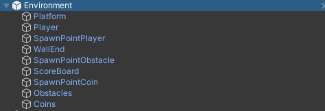

#### Script Environment

```csharp
public class Environment : MonoBehaviour
{
    public Transform obstacleSpawnPoint;
    public Transform coinSpawnPoint;
    public Coin coinPrefab;
    public Obstacle obsactlePrefab;
    public GameObject obstacles;
    public GameObject coins;
    public float minSpawnTimeObstacle = 3f;
    public float maxSpawnTimeObstacle = 6f;
    public float minSpawnTimeCoin = 3f;
    public float maxSpawnTimeCoin = 20f;

    private GameObject spawnedObstacle;
    private GameObject spawnedCoin;
    private Player player;
    private TextMeshPro scoreboard;

    public void OnEnable()
    {
        this.player = this.transform.GetComponentInChildren<Player>();
        this.scoreboard = this.transform.GetComponentInChildren<TextMeshPro>();
    }

    private void FixedUpdate()
    {
        this.scoreboard.text = player.GetCumulativeReward().ToString("f2");
    }

    public void SpawnObstacle()
    {
        spawnedObstacle = Instantiate(obsactlePrefab.gameObject);
        spawnedObstacle.transform.SetParent(obstacles.transform);
        spawnedObstacle.transform.position = new Vector3(obstacleSpawnPoint.position.x, obstacleSpawnPoint.position.y, obstacleSpawnPoint.position.z);
        Invoke("SpawnObstacle", Random.Range(minSpawnTimeObstacle, maxSpawnTimeObstacle));
    }

    public void SpawnCoin()
    {
        spawnedCoin = Instantiate(coinPrefab.gameObject);
        spawnedCoin.transform.position = new Vector3(coinSpawnPoint.position.x, coinSpawnPoint.position.y, coinSpawnPoint.position.z);
        spawnedCoin.transform.SetParent(coins.transform);
        Invoke("SpawnCoin", Random.Range(minSpawnTimeCoin, maxSpawnTimeCoin));
    }

    public void DestroyAllSpawnedObjects()
    {
        CancelInvoke();
        foreach(Transform obstacle in obstacles.transform)
        {
            Destroy(obstacle.gameObject);
        }
        foreach(Transform coin in coins.transform)
        {
            Destroy(coin.gameObject);
        }
    }
}
```

Het Environment script wordt gebruikt om de **Obstacles** en de Coins in te spawnen op willekeurige momenten. Hiervoor worden de *SpawnObstacle* en *SpawnCoin* methodes gebruikt. Deze methodes instantiëren
een nieuw **Obstacle** of **Coin** die worden toegevoegd aan hun parent, *obstacles* of *coins*. De GameObjecten worden aan de hand van het *obstacleSpawnPoint* en *coinSpawnPoint* op de juiste plek gespawned. De *minSpawnTimeObstacle*, *maxSpawnTimeObstacle*, *minSpawnTimeCoin* en *maxSpawnTimeCoin* variabelen bepalen de minimum en maximumtijd waartussen de **Obstacles** en **Coin** kunnen spawnen.

De *FixedUpdate* methode wordt gebruikt om het scoreboard up te daten met de laatste comulatieve beloning van de **Agent**.

De *DestroyAllSpawnedObjects* methode wordt gebruikt om de parent GameObjecten, *obstacles* en *coins*, leeg te maken.

### Player

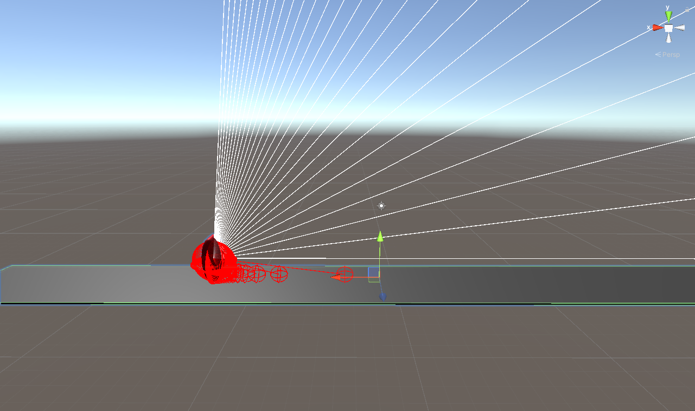

Het **Player** GameObject is het object dat gebruikt wordt door ML-Agent om te trainen. Dit GameObject kan enkel springen.

#### Settings Player

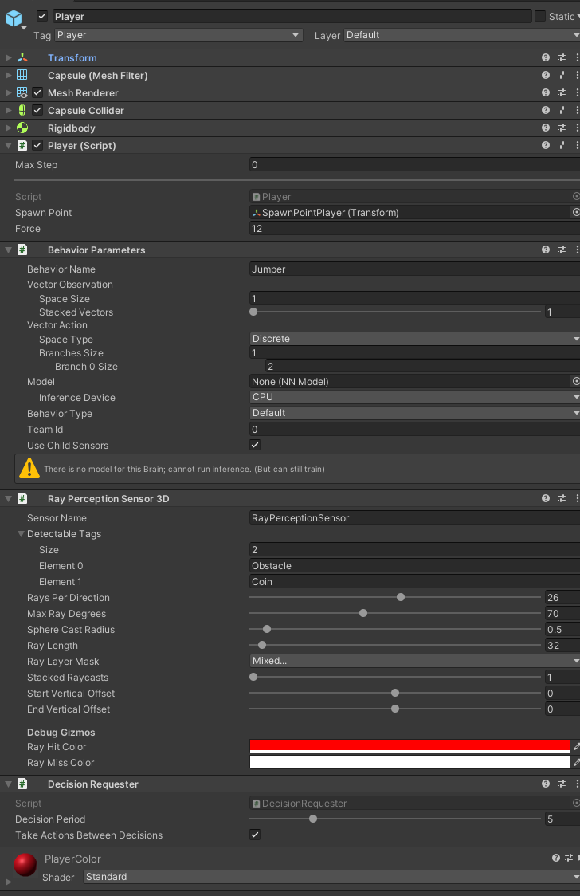

Aan het **Player** GameObject worden enkele scripts toegevoegd.

Bij de instellingen van het **Player** script kunnen we het spawnpoint en de kracht van het springen definiëren.

Bij de instellingen van de Behavior Parameters is het belangrijk dat we de Behavior Name de naam "Jumper" geven. Hierdoor kunnen we later bij het trainen de instellingen van het yml-bestand doorgeven.

Bij de instellingen van de Ray Perception Sensor 3D stellen we in wat de **Player** kan zien. We zetten de Rays Per Direction parameter op 26 zodat er meerdere rays naar boven kijken om de **Coin** te kunnen vangen. We voegen ook de twee Detectable Tags toe waarmee de **Agent** rekening moet houden. Deze tags zijn het **Obstacle** en de **Coin**.

Bij de instellingen van de Decision Requester kunnen we instellen hoe vaak de **Agent** een decision vraagt. We stellen de Decision Period in op 5.

#### Script Player

```csharp
public class Player : Agent
{
    private Environment environment;
    private Rigidbody body;
    public Transform spawnPoint = null;
    public float Force = 15f;
    private bool canJump = false;

    public override void Initialize()
    {
        this.body = this.GetComponent<Rigidbody>();
        this.environment = this.GetComponentInParent<Environment>();
    }

    public override void OnEpisodeBegin()
    {
        ResetPlayer();
        environment.DestroyAllSpawnedObjects();
        environment.SpawnObstacle();
        environment.Invoke("SpawnCoin", Random.Range(environment.minSpawnTimeCoin, environment.maxSpawnTimeCoin));
    }

    private void OnCollisionEnter(Collision collision)
    {
        if (collision.gameObject.CompareTag("Obstacle") == true)
        {
            AddReward(-2.0f);
            Destroy(collision.gameObject);
            EndEpisode();
        }
        if(collision.gameObject.CompareTag("Road") == true)
        {
            this.canJump = true;
        }
    }

    private void OnTriggerEnter(Collider other)
    {
        if (other.CompareTag("Coin"))
        {
            AddReward(0.6f);
            Destroy(other.gameObject);
            if (this.GetCumulativeReward() >= 50f)
            {
                EndEpisode();
            }
        }
        if (other.CompareTag("Reward") == true)
        {
            AddReward(0.2f);
            Destroy(other.gameObject);
        }
    }

    void MoveUpwards()
    {
        AddReward(-0.1f);
        canJump = false;
        body.AddForce(Vector3.up * Force, ForceMode.Impulse);
    }

    public override void OnActionReceived(float[] vectorAction)
    {
        if(vectorAction[0] == 1 && canJump)
        {
            MoveUpwards();
        }
    }

    public override void Heuristic(float[] actionsOut)
    {
        actionsOut[0] = 0;
        if(Input.GetKey(KeyCode.UpArrow) == true && canJump)
        {
            actionsOut[0] = 1;
        }
    }

    private void ResetPlayer()
    {
        this.body.angularVelocity = Vector3.zero;
        this.body.velocity = Vector3.zero;
        this.transform.position = new Vector3(spawnPoint.position.x, spawnPoint.position.y, spawnPoint.position.z);
    }
}
```

- **Initialize** - We slagen de rigidbody in een private variabel op. Deze is later nodig om te kunnen springen. Dit doen we ook voor het parent object waarin de **player** zich bevindt.
- **OnEpisodeBegin** - We resetten de **player** ( velocity, angularVelocity, position). We laten direct een **obstacle** spawnen en Invoken we de methode voor een **Coin** te laten spawnen (**obstacle** spawnt altijd vanaf het begin. **Coin** spawnt na enkele tijd).
- **OnCollisionEnter** - Wanneer we een collision hebben met een **obstacle**, wordt er een straf gegeven (-2.00f) en de episode wordt beëindigd. Wanneer de **player** de grond terug raakt, wordt hij terug toegelaten om te springen.
- **OnTriggerEnter** - Hier worden de rewards van 'Coin' en 'Reward' bepaald.
- **MoveUpwards** - Methode om te springen.
- **OnActionRecieved** - Bepaald de mogelijke acties voor de **agent**.
- **Heuristic** - Staat een input van het toetsenbord toe om de **player** te controleren.

### Platform

Het platform is een GameObject waarop de **Player** en de **Obstacles** spawnen.

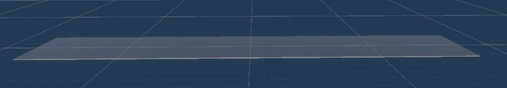

#### Setting Platform

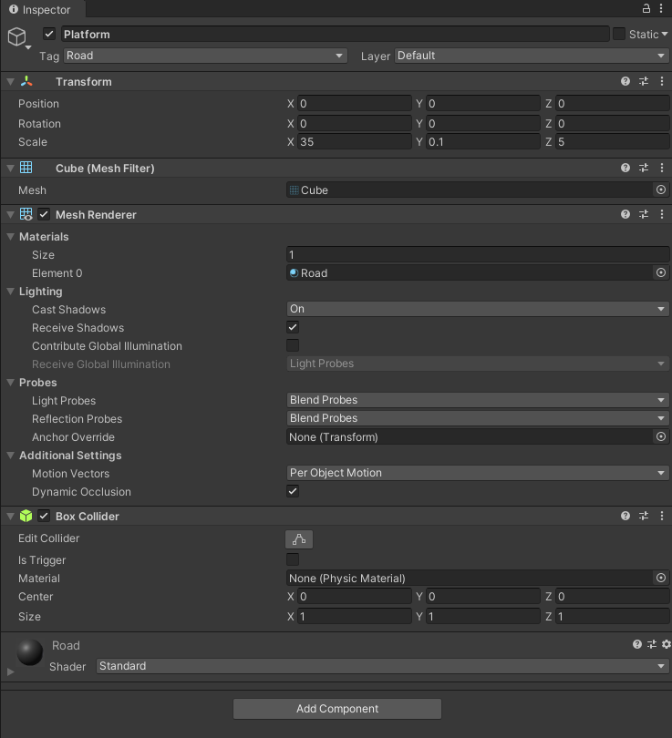

In de settings van het platform configureren we de grote zodat het een plat langwerpig platform is. Het is belangrijk om dit GameObject de Tag "Road" te geven zodat de **Player** weet wanneer hij op de grond staat.

### Obstacle

Een obstacle bestaat uit 2 game objecten. Een muur waar de **player** moet overspringen en een reward zone. Deze 2 objecten zitten samen in een prefab. Zo worden ze als één object ingespawned.

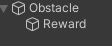

*Voor een visualisatie van de reward zone, is de 'Mesh Renderer' van het gameObject 'Reward' aangezet*
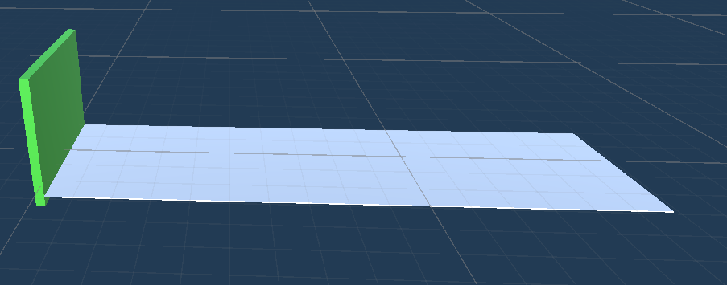

Er zijn 2 mogelijke scenario's:

1. De **player** springt over het **obstacle** (-0.10f). Vervolgens landt de **player** in de reward zone. Hier wordt de **agent** beloond voor het halen van een **obstacle** (+0.10) en krijgt hij een compensatie voor zijn sprong (+0.10).
2. De **player** raakt het **obstacle**. Hier krijgt de **agent** een straf (-2.00f). Vervolgens wordt de episode van de **agent** herstart.

#### Settings Obstacle

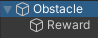

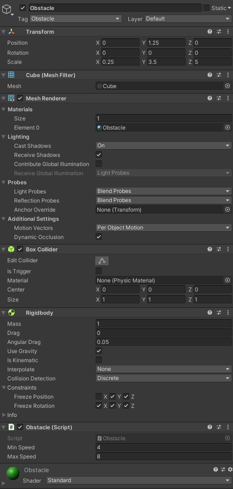

Het is belangrijk dat we het GameObject de tag 'Obstacle' geven. Deze tag wordt gebruikt om het gameObject 'Obstacle' apart aan te spreken van de prefab 'Obstacle'. We maken de breedte van het **Obstacle** breed genoeg, zodat de **player** er niet langs zou kunnen gaan. De hoogte is bepaald zodat de **player** er net over geraakt met een sprong. **Obstacle** moet een Collider en een Rigidbody bevatten om collisions te detecteren met de **player**. Bij de Rigidbody is het belangrijk dat we de positie freezen tot dat hij enkel beweegbaar is op de X as.

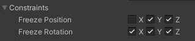

Tenslotte voegen we het script 'Obstacle' toe.

#### Script Obstacle

```csharp
public class Obstacle : MonoBehaviour
{
    public float minSpeed = 0.5f;
    public float maxSpeed = 0.6f;
    private float speed;

    private void Start()
    {
        this.speed = Random.Range(minSpeed, maxSpeed);
    }
    void FixedUpdate()
    {
        this.transform.Translate(Vector3.right * this.speed * Time.deltaTime);
    }
}
```

Elke keer wanneer een **Obstacle** spawnt, is de speed willekeurig. De minimum en maximum speed is bepaald door de 2 public variabels:

- *minSpeed*
- *maxSpeed*

#### Settings Reward

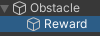

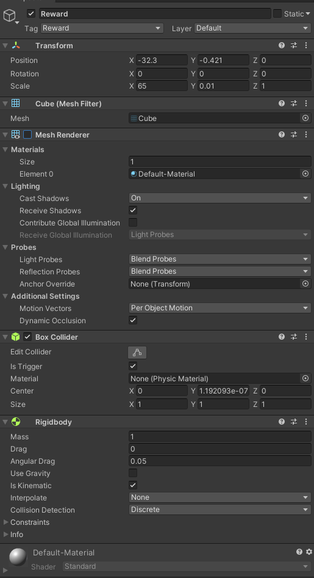

Ook hier is een belangrijke tag aanwezig: 'Reward'. De locatie van dit GameObject bevindt zich op de grond, achter het **obstacle**. Het GameObject moet de volledige zone bedekken waar een **player** mogelijk kan landen na het springen over een **obstacle**. De zone hoeft niet zichtbaar te zijn dus mesh renderer wordt uitgezet. Reward bevat ook een box collider en een rigidbody om correct collisions or triggers te kunnen detecteren met andere GameObjecten. Het is belangrijk dat de collider een trigger is en rigidbody 'kinematic' is.

### WallEnd

Op het einde van het Platform staat nog GameObject om alle GameObjecten die richting de **player** bewegen op te vangen en te verwijderen. Zo blijft de environment proper.

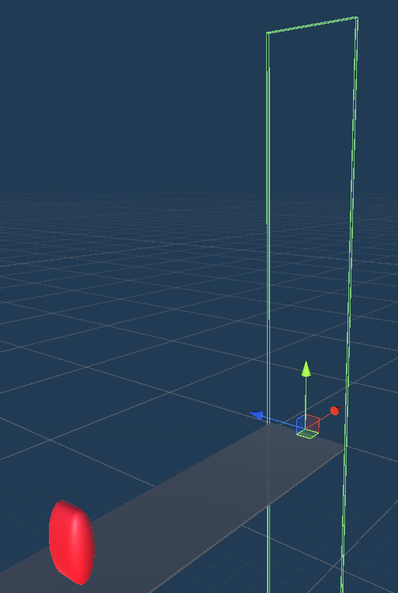

#### Settings WallEnd

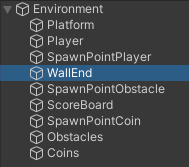

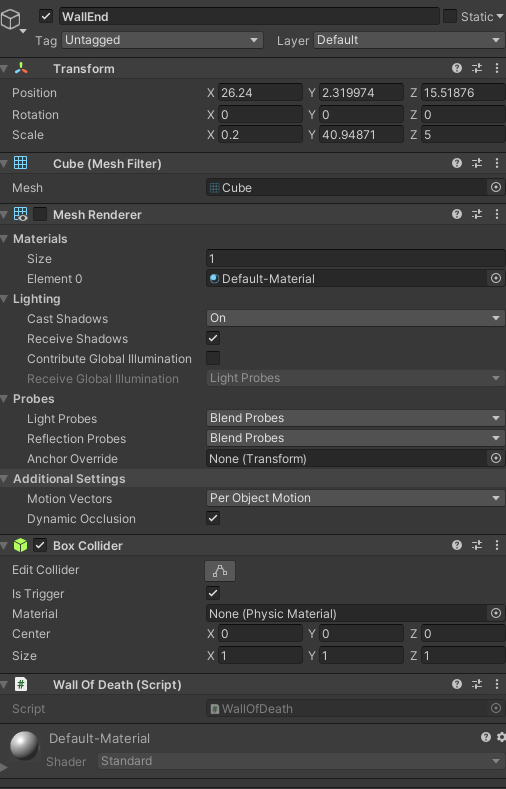

WallEnd positioneren we aan het einde van het platform, achter de **player**. WallEnd hoeft ook niet zichtbaar te zijn dus Mesh Renderer zetten we uit. WallEnd heeft een Collider waar we selecteren dat het een Trigger is. Tenslotte voegen we het script 'WallOfDeath' toe.

#### Script WallEnd

``` csharp
public class WallOfDeath : MonoBehaviour
{
    private void OnTriggerEnter(Collider other)
    {
        Destroy(other.gameObject);
    }
}
```

Wanneer een GameObject de WallEnd triggert, wordt het direct verwijderd.

### Coin

De **player** kan meer punten verdienen door **Coin** op te pakken. Deze spawnen ook willekeurig boven het platform.

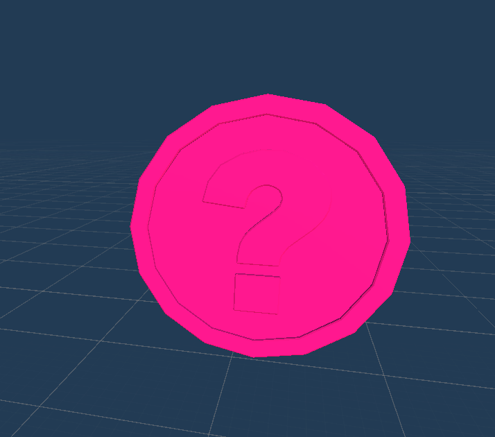

#### Settings Coin

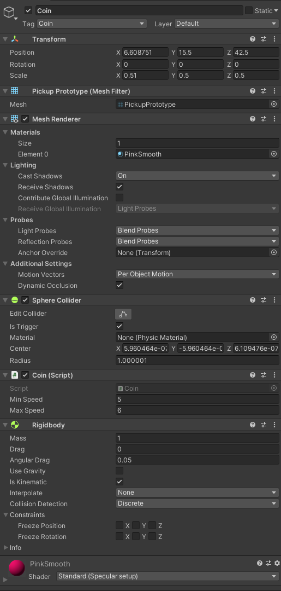

We geven het object de tag: 'Coin'. Zo kunnen we het object makkelijk aanspreken in andere klassen. **Coin** bevat een Sphere Collider en een RigidBody. In de collider specifiëren we dat **Coin** een trigger is. In de rigidbody vinken we de 'Is Kinematic' aan. Tenslotte voegen we het script 'Coin' toe.

#### Script Coin

```csharp
public class Coin : MonoBehaviour
{
    public float minSpeed = 2f;
    public float maxSpeed = 6f;
    private float speed;
    void Start()
    {
        this.speed = Random.Range(minSpeed, maxSpeed);
    }

    void FixedUpdate()
    {
        this.transform.Translate(Vector3.right * this.speed * Time.deltaTime);
    }
    private void OnTriggerEnter(Collider other)
    {
        if (other.gameObject.CompareTag("Wall"))
        {
            Destroy(this.gameObject);
        }
    }
}
```

Zoals een **obstacle** heeft een **Coin** ook een *minSpeed* en *maxSpeed* die een willekeurige snelheid bepalen.

## Trainen van de Agent

Om de **Agent** te trainen moeten we gebruik maken van MLAgents in een Python omgeving. In de map van het project wordt een nieuwe map *Learning* gemaakt waarin al de data van het Learning-proces wordt opgeslagen. In deze map wordt het volgende config-bestand geplaatst met de naam "Jumper.yml".

```yml
behaviors:
  Jumper:
    trainer_type: ppo
    max_steps: 5.0e8
    time_horizon: 64
    summary_freq: 10000
    keep_checkpoints: 5
    checkpoint_interval: 50000
    
    hyperparameters:
      batch_size: 32
      buffer_size: 9600
      learning_rate: 3.0e-4
      learning_rate_schedule: constant
      beta: 5.0e-3
      epsilon: 0.2
      lambd: 0.95
      num_epoch: 3

    network_settings:
      num_layers: 2
      hidden_units: 128
      normalize: false
      vis_encoder_type: simple

    reward_signals:
      extrinsic:
        strength: 1.0
        gamma: 0.99
      curiosity:
        strength: 0.02
        gamma: 0.99
        encoding_size: 256
        learning_rate : 1e-3
```

Om het leren te starten moet het volgende commando worden uitgevoerd in een terminal:

```command
mlagents-learn Jumper.yml --run-id Jumper-01
```

Door vervolgens op de start knop te drukken in Unity zal het leren beginnen.
Tijdens het leren kunnen we een live overzicht krijgen via TensorBoard door middel van volgend commando:

```commando
tensorboard --logdir results
```

## Voorbeeld

Het reedst gecreëerde brein, is terug te vinden in Assets/Brains/Jumper.nn

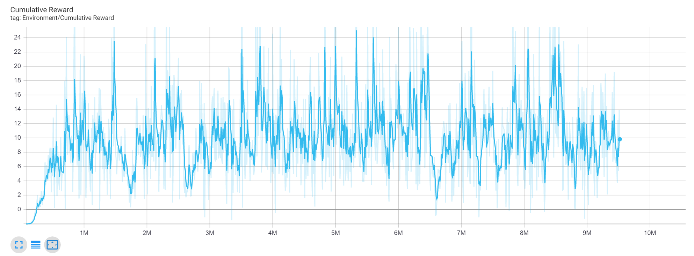

In deze grafiek kunnen we de cumulatieve beloning zien van een test training. We zien nog veel variatie tussen de episodes omdat niet elke environment zijn episode op hetzelfde moment eindigd. Environements die sneller eindigen worden sneller opgeslagen dan environments die later eindigen.

## Bronnen

- David D'Haese (18-11-2020) <https://ddhaese.github.io/ML-Agents/>
- Sebastian Schuchmann (18-05-2020) <https://www.youtube.com/watch?v=2Js4KiDwiyU>
- Omar Santiago (28-10-2020) <https://www.youtube.com/watch?v=4YnuT5QMvM4&list=LL&index=2&t=1260s&ab_channel=OmarSantiago>
